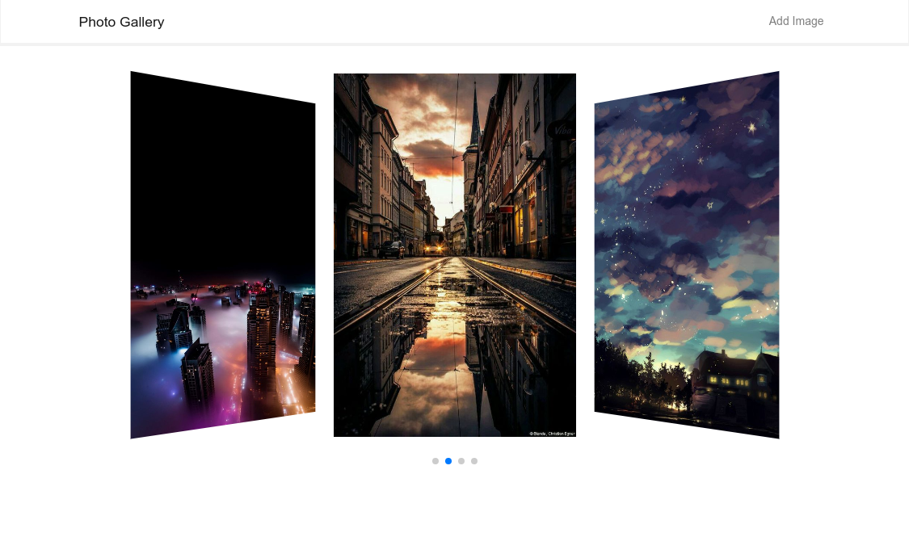
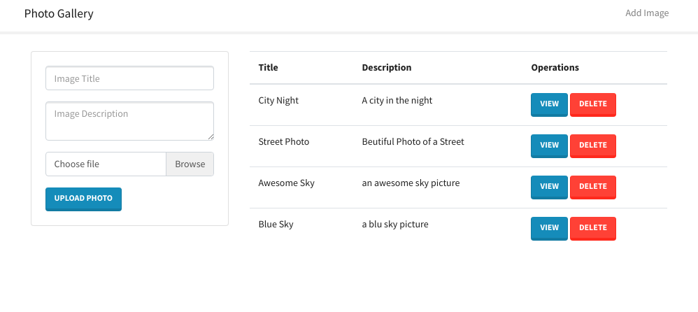

# Nodejs & Clodinary Gallery Photos Example

# Installation
1. navigate to the project folder
2. install dependencies: `npm install`
3. define your environment variables: 
    - PORT=4000
    - MONGODB_URI=mongodb://localhost/cloudinary_test_db
   - CLOUDINARY_CLOUD_NAME=
    - CLOUDINARY_API_KEY=
    - CLOUDINARY_API_SECRET=
4. start with `npm start` or `npm run dev`